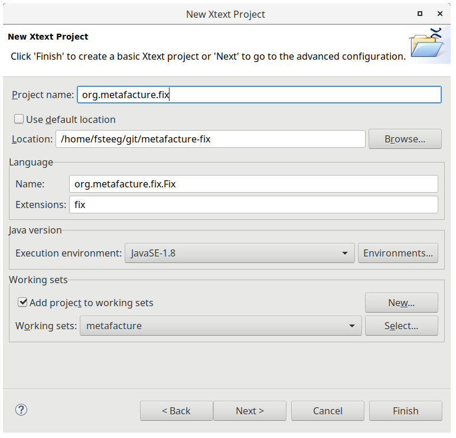

About
-----

This is early work in progress towards an implementation of the Fix language for Metafacture as an alternative to configuring data transformations with [Metamorph](https://github.com/metafacture/metafacture-core/wiki#morph).

See [https://github.com/elag/FIG](https://github.com/elag/FIG)

State
-----

[](https://travis-ci.org/metafacture/metafacture-fix)

This repo contains an Xtext web project with a basic Fix grammar, which generates a parser and a web editor. The editor UI contains input fields for sample data and a [Flux](https://github.com/metafacture/metafacture-core/wiki#flux) definition to run workflows with the given Fix. A test deployment is available at: [http://test.lobid.org/fix](http://test.lobid.org/fix)

- [x] Grammar, parser, and editor for the [Fix language]((https://github.com/LibreCat/Catmandu/wiki/Fix-language)) ([details](#editor))
- [x] Run Fix as a module in Flux workflows ([wiki](https://github.com/metafacture/metafacture-core/wiki/Flux-user-guide)) ([details](http://test.lobid.org/fix))
- [x] Change field names, (nested) field [paths](https://github.com/LibreCat/Catmandu/wiki/Paths) ([details](http://test.lobid.org/fix))
- [ ] Change field values, use `metamorph.functions` ([wiki](https://github.com/metafacture/metafacture-core/wiki/Metamorph-functions)) as Fix [functions](https://github.com/LibreCat/Catmandu/wiki/Functions) like `replace_all(title,"My (.*) Pony","Our $1 Fish")` [#5](https://github.com/metafacture/metafacture-fix/issues/5)
- [ ] Data lookup, use `metamorph.maps` ([wiki](https://github.com/metafacture/metafacture-core/wiki/Data-lookup)) like `lookup(title,"dict.csv",default:'NONE')`
- [ ] Use `metamorph.collectors` and `<if>` ([wiki](https://github.com/metafacture/metafacture-core/wiki/Metamorph-collectors), [commit](https://github.com/metafacture/metafacture-core/commit/0530d6ad72ced992b479bff94d6f56bbef77bb2d)) for Fix [selectors](https://github.com/LibreCat/Catmandu/wiki/Selectors) and [conditionals](https://github.com/LibreCat/Catmandu/wiki/Conditionals) like `if exists(my.deep.field) <function1 function2> end`
- [ ] Support function grouping ([wiki](https://github.com/metafacture/metafacture-core/wiki/Metamorph-User-Guide#processing-pieces-of-data)) with [binds](https://github.com/LibreCat/Catmandu/wiki/Binds) like `do list(path:colors.*, var:c) <function1(c) function2(c)> end`
- [ ] [Comments](https://github.com/LibreCat/Catmandu/wiki/Comments) like `# This is a comment` [#4](https://github.com/metafacture/metafacture-fix/issues/4)
- [ ] Integrated web playground with Fix and Flux editors ([language](https://github.com/culturegraph/metafacture-ide/tree/master/bundles/org.culturegraph.mf.ide/src/org/culturegraph/mf/ide), [setup](https://github.com/metafacture/metafacture-fix#xtext))

Setup
-----

If you're using Windows, configure git option core.autocrlf before cloning repository:
`git config core.autocrlf false`
Otherwise git will change all line endings to Windows crlf when you check out code (and vice versa) but that will lead to failures with gradle's check task.

Go to the Git repository root:

`cd metafacture-fix/`

Run the tests (in `org.metafacture.fix/src/test/java`) and checks (`.editorconfig`, `config/checkstyle/checkstyle.xml`):

`./gradlew clean check`

Editor
------

Start the server:

`./gradlew jettyRun`

Visit [http://localhost:8080/](http://localhost:8080/), and paste this into the editor:

```
# Fix is a macro-language for data transformations

# Simple fixes

add_field(hello,"world")
remove_field(my.deep.nested.junk)
copy_field(stats,output.$append)

# Conditionals

if exists(error)
    set_field(is_valid, no)
    log(error)
elsif exists(warning)
    set_field(is_valid, yes)
    log(warning)
else
    set_field(is_valid, yes)
end

# Loops

do list(path)
    add_field(foo,bar)
end

# Nested expressions

do marc_each()
    if marc_has(f700)
        marc_map(f700a,authors.$append)
    end
end
```

Content assist is triggered with Ctrl-Space. The input above is also used in `FixParsingTest.xtend`.

Module
------

The `Metafix` stream module currently supports:

```
# simple field name mappings

map(a,b)

# nested field name mappings

map(a,my.deep.nested.b)

# pass-through for unmapped fields

map(_else)

# adding simple fields

add_field(hello,"world")

# adding nested fields

add_field(my.deep.nested,"world")
```

See also `MetafixDslTest.java`.

Workflows
--------

Run workflows, passing `data`, `flux`, and `fix`:

[http://localhost:8080/xtext-service/run?data='1'{'a': '5', 'z': 10}&flux=as-lines|decode-formeta|fix|encode-formeta(style="multiline")&fix=map(a,b) map(_else)](http://localhost:8080/xtext-service/run?data=%271%27{%27a%27:%20%275%27,%20%27z%27:%2010}&flux=as-lines|decode-formeta|fix|encode-formeta(style=%22multiline%22)&fix=map(a,c)%20map(_else))

Eclipse IDE
-----------

To import the projects in Eclipse, choose File > Import > Existing Gradle Project and select the `metafacture-fix` directory.

Xtext
-----

This repo has been originally set up with Xtext 2.17.0 and Eclipse for Java 2019-03, following [https://www.eclipse.org/Xtext/documentation/104_jvmdomainmodel.html](https://www.eclipse.org/Xtext/documentation/104_jvmdomainmodel.html). Below are some details to reproduce the original setup:

In the New > Xtext Project wizard, the language details are specified:



As well as the project and build customization:


Visual Studio Code Extension
---------------------------
The project `org.metafacture.fix.vsc` provides an extension for Visual Studio Code for `fix` via the language server protocol (LSP). In the current state the extension supports auto completion, simple syntax highlighting and auto closing brackets and quotes. This project was created using the [tutorial](https://www.typefox.io/blog/building-a-vs-code-extension-with-xtext-and-the-language-server-protocol) and the corresponding [example](https://github.com/TypeFox/languageserver-example).

Start extension:

1. Install Visual Studio Code / alternative: VS Codium
2. Install Node.js (including npm)
3. Checkout metafacture-fix project
4. In metafacture-fix execute:
Unix: `./gradlew installServer`
Windows: `.\gradlew.bat installServer`
5. In org.metafacture.fix.vsc execute (tip: if you use windows, install cygwin to execute npm commands):
`npm install`
6. Open org.metafacture.fix.vsc in Visual Studio Code
7. Launch vscode extension by pressing F5 (opens new window of Visual Studio Code)
8. Open new file (file-ending .fix) or open existing fix-file
